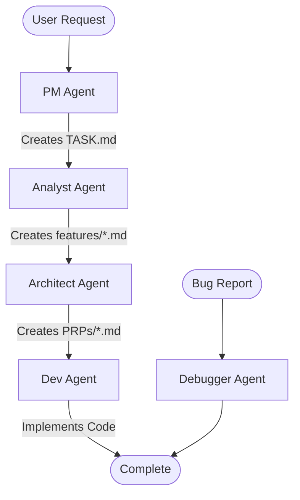

# Context Engineering Agents

A sophisticated multi-agent development workflow that enforces rigorous requirements capture, prevents context loss, and maintains code quality through automated validation gates.

## 🎯 Overview

This project implements a Context Engineering workflow with specialized agents that work together to transform ideas into production-ready code. The system maintains complete traceability from requirements to implementation.

## 🏗️ Architecture



## 🤖 Agents

### 1. **PM Agent** (Project Manager)
- Conducts structured project intake interviews
- Creates and maintains `project.md` and `TASK.md`
- Manages task prioritization and dependencies
- Estimates complexity and timelines

### 2. **Analyst Agent** (Feature Documentarian)
- Transforms tasks into detailed feature specifications
- Documents edge cases and constraints
- Identifies technical requirements
- Creates `features/<N>-<name>.md` documents

### 3. **Architect Agent** (Requirements Engineer)
- Transforms features into executable Product Requirements Prompts (PRPs)
- Conducts parallel research using multiple sources
- Designs implementation approach with rationale
- Creates validation gates and test cases

### 4. **Dev Agent** (Implementation Executor)
- Executes PRPs with step-by-step validation
- Runs tests and quality checks at each stage
- Generates comprehensive execution reports
- Ensures all validation gates pass

### 5. **Debugger Agent** (Issue Resolver)
- Single-pass bug diagnosis and fix
- Leverages full context history for informed debugging
- Implements minimal, targeted fixes
- Documents root cause analysis

## 💡 Key Features

### Validation Gates
- **Requirements Completeness**: Ensures all aspects are documented
- **Design Validation**: Verifies architectural decisions
- **Implementation Checks**: Tests, linting, type checking
- **Performance Benchmarks**: Meets defined SLAs

### Error Recovery
- **Partial Progress Preservation**: Never lose work
- **Blocker Documentation**: Clear escalation paths

## 📁 Project Structure

```
/
├── .claude/
│   ├── agents/         # Agent definitions
│   └── CLAUDE.md       # Project guidelines
├── project.md          # Project charter
├── TASK.md            # Task list
├── features/          # Feature specifications
│   └── <N>-<name>.md
├── PRPs/              # Product Requirements Prompts
│   └── <name>.md
├── src/               # Source code
├── tests/             # Test files
│   ├── unit/
│   ├── integration/
│   └── e2e/
├── reports/           # Execution reports
│   ├── prp-execution-*.md
│   └── debug/
└── examples/          # Code patterns
```

## 🚀 Getting Started

### Prerequisites
- Claude Code CLI
- Git for version control

### Basic Workflow

1. **Start a New Project**
```bash
# PM agent conducts intake interview
claude "I need to build a task management API"
```

2. **Create Feature Documentation**
```bash
# Analyst processes next task from TASK.md
claude "Create feature doc for the next task"
```

3. **Generate Requirements**
```bash
# Architect creates PRP from feature doc
claude "Generate PRP for the task API feature"
```

4. **Implement Feature**
```bash
# Dev agent executes PRP with validation
claude "Implement the task API PRP"
```

5. **Fix Issues**
```bash
# Debugger diagnoses and fixes with full context
claude "Fix: TypeError in task creation endpoint"
```


## 📊 Validation & Quality

Each stage has validation gates:
- **Feature Documents**: >90% completeness required
- **PRPs**: All sections populated with test cases
- **Implementation**: Tests pass, linter clean, types check
- **Performance**: Meets defined benchmarks

## 🛠️ Integration

### Development Tools
Compatible with:
- Any programming language
- Any testing framework
- Any deployment platform
- CI/CD pipelines

## 📈 Benefits

### For Development Teams
- **Reduced Bugs**: Validation at every stage
- **Faster Debugging**: Complete context available instantly
- **Safe Development**: Structured workflow prevents conflicts

### For Project Management
- **Complete Traceability**: Requirements to implementation
- **Risk Mitigation**: Early constraint identification
- **Progress Visibility**: Real-time task status
- **Quality Assurance**: Automated gates

### For Code Quality
- **Consistent Architecture**: Decisions tracked and enforced
- **Comprehensive Testing**: Required at each stage
- **Performance Guarantees**: Built-in benchmarking
- **Technical Debt Prevention**: Clean code enforced

## 📚 Documentation

- [Context Engineering Workflow](docs/CONTEXT_ENGINEERING_WORKFLOW.md) - Complete workflow guide
- [CLAUDE.md](CLAUDE.md) - Project guidelines and rules

## 🤝 Contributing

This workflow is designed to be extended. To add new agents:
1. Create agent definition in `.claude/agents/`
2. Update workflow documentation
3. Define validation gates

## 📝 License

This project provides a development workflow methodology and is provided as-is for use in software projects.

## 🙏 Acknowledgments

Built using:
- Claude Code by Anthropic
- Context Engineering methodology for rigorous requirements capture

---

**Transform your development workflow from chaotic to systematic.**