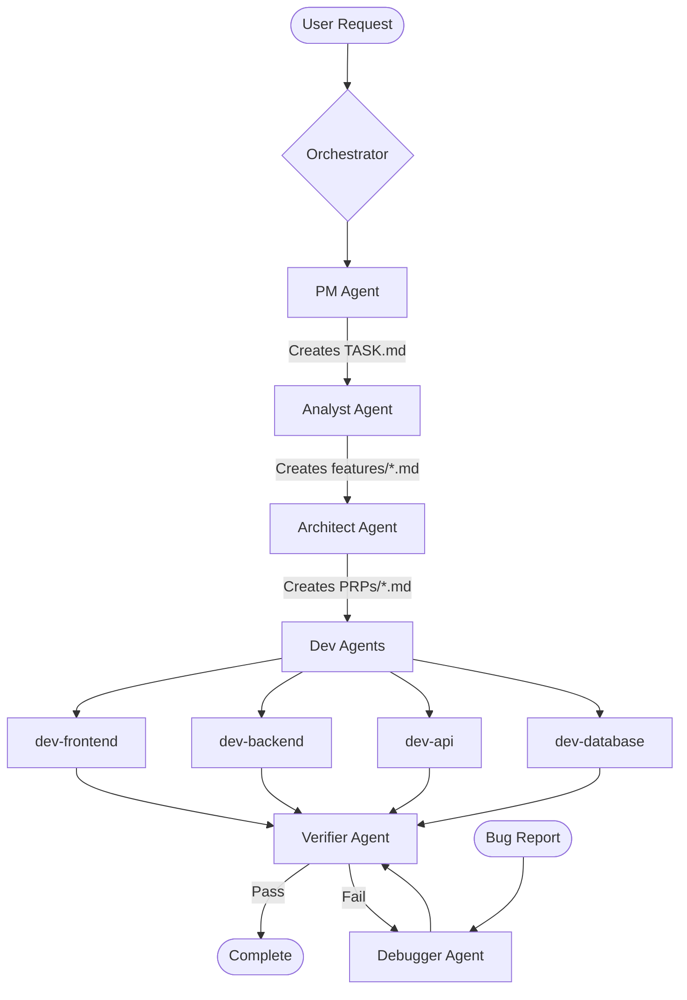

# Context Engineering Framework

An orchestrator-driven development framework that coordinates specialized agents to deliver verified, production-ready code. Built on Claude Code with systematic workflows that eliminate context loss and enforce quality gates.

## 🎯 Overview

Context Engineering is a development methodology that uses an **orchestrator** to coordinate specialized agents through structured workflows. Each agent has a specific domain expertise, and the orchestrator ensures proper sequencing, parallel execution, and mandatory verification loops.

## 🏗️ Architecture



## 🤖 Agent Ecosystem

### **Orchestrator** (Command Center)
- **NEVER implements code directly** - pure coordination role
- Maps user requests to appropriate specialized agents
- Executes agents in optimal parallel/sequential patterns
- Enforces mandatory verification loops
- Manages handoffs and progress tracking

### Specialized Agents

#### **PM Agent** (Project Manager)
- Conducts structured project intake interviews
- Creates and maintains `project.md` and `TASK.md`
- Manages task prioritization and dependencies
- Handles feature addition to existing projects

#### **Analyst Agent** (Feature Documentarian)
- Transforms TASK.md entries into detailed feature specifications
- Documents edge cases, constraints, and technical requirements
- Creates `features/<N>-<name>.md` documents

#### **Architect Agent** (Requirements Engineer)
- Transforms features into executable Product Requirements Prompts (PRPs)
- Conducts parallel research using multiple MCPs
- Designs implementation approach with validation gates
- Creates comprehensive test cases and acceptance criteria

#### **Dev Agents** (Domain Specialists)
- **dev-frontend**: UI components, styling, browser-side implementation
- **dev-backend**: Server logic, business rules, middleware, authentication
- **dev-api**: REST/GraphQL endpoints, API documentation, contracts
- **dev-database**: Schema design, migrations, query optimization

#### **Verifier Agent** (Quality Assurance)
- **MANDATORY after ANY implementation**
- Confirms implementations ACTUALLY WORK in real conditions
- Runs comprehensive test suites and quality checks
- 30-second reality check philosophy

#### **Debugger Agent** (Issue Resolver)
- Single-pass bug diagnosis and fix
- Leverages existing context (INITIAL.md, PRPs, examples)
- Implements minimal, targeted fixes
- Documents root cause analysis

## 💡 Key Features

### Orchestrator-Driven Workflow
- **Pure Coordination**: Orchestrator never implements - only coordinates
- **Parallel Execution**: Safely runs multiple agents simultaneously
- **Dependency Management**: Respects task prerequisites and sequencing
- **Verification Loops**: Mandatory verifier → debugger → verifier cycles

### Specialized Agent Architecture
- **Domain Expertise**: Each agent focused on specific development area
- **Context Preservation**: Complete traceability from requirements to code
- **Quality Gates**: Automated validation at every stage
- **Pattern Extraction**: Reusable implementations stored in examples/

### Always Works™ Philosophy
- **Real-World Testing**: Verifier tests actual functionality, not assumptions
- **Error Recovery**: Debugger agent handles failures systematically
- **Quality Enforcement**: Nothing marked complete without verifier approval
- **Continuous Validation**: Linting, testing, type checking before commits

## 📁 Project Structure

```
/
├── .claude/
│   ├── agents/         # Agent definitions (DO NOT MODIFY)
│   └── output-styles/  # Orchestrator and specialized output styles
├── project.md          # Project charter (created by pm agent)
├── TASK.md            # Task list (maintained by pm agent)
├── features/          # Feature specifications (created by analyst)
│   └── <N>-<name>.md
├── PRPs/              # Product Requirements Prompts (created by architect)
│   └── <name>.md
├── src/               # Source code
├── tests/             # ALL test files MUST go here
│   ├── unit/
│   ├── integration/
│   └── e2e/
├── reports/           # Execution reports and debug logs
│   ├── prp-execution-*.md
│   ├── debug/
│   └── artifacts/
├── examples/          # Reusable code patterns
└── docs/              # User documentation
```

## 🚀 Getting Started

### Prerequisites
- Claude Code CLI
- Git for version control
- Node.js 16+ (for JavaScript projects)

### Basic Workflow

1. **Activate Orchestrator Mode**
```bash
/output-style orchestrator
```

2. **Start a New Project**
```bash
# Orchestrator uses PM agent for project setup
claude "I need to build a task management API"
```

3. **Create Feature Documentation**
```bash
# Orchestrator uses analyst agent for next TASK.md entry
claude "Create feature doc for the next task"
```

4. **Generate Requirements**
```bash
# Orchestrator uses architect agent
claude "Generate PRP for the task API feature"
```

5. **Implement Feature**
```bash
# Orchestrator coordinates appropriate dev agents
claude "Implement the task API PRP"
# → Uses dev-backend for server logic
# → Uses dev-api for endpoint documentation
# → Uses dev-database for schema design
# → AUTOMATICALLY runs verifier agent
```

6. **Fix Issues (If Verifier Fails)**
```bash
# Orchestrator AUTOMATICALLY uses debugger agent
# → Then re-runs verifier until pass
claude "Debug: API tests failing on validation"
```


## 📊 Validation & Quality

### Mandatory Verification Loops
- **After ANY dev agent**: Verifier agent AUTOMATICALLY invoked
- **If verifier fails**: Debugger agent AUTOMATICALLY invoked
- **After debugger**: Verifier re-run (max 3 cycles)
- **Only then**: Task marked complete in TASK.md

### Quality Gates
- **Feature Documents**: Complete specifications with edge cases
- **PRPs**: Comprehensive test cases and validation gates
- **Implementation**: Tests pass, linter clean, types check
- **Integration**: Verifier confirms real-world functionality
- **File Organization**: Strict directory structure enforcement

## 🛠️ Integration

### Development Tools
Compatible with:
- **Languages**: Any (JavaScript/Node.js optimized)
- **Testing**: Jest, Mocha, pytest, etc.
- **Linting**: ESLint, Prettier, ruff, etc.
- **CI/CD**: GitHub Actions, Jenkins, etc.
- **Version Control**: Git workflows and hooks

### Output Styles
- **Orchestrator**: Pure agent coordination mode
- **Specialized**: Domain-specific agent styles (future)
- **Custom**: Project-specific output styles

## 📈 Benefits

### For Development Teams
- **Zero Context Loss**: Complete traceability from requirements to code
- **Parallel Development**: Safe concurrent work across domains
- **Mandatory Quality**: Nothing ships without verifier approval
- **Instant Debugging**: Full context available to debugger agent

### For Project Management
- **Structured Workflows**: PM agent handles proper task breakdown
- **Real-Time Status**: TASK.md always reflects current state
- **Risk Mitigation**: Verification loops catch issues early
- **Predictable Delivery**: Always Works™ philosophy

### For Code Quality
- **Domain Expertise**: Specialized agents for each area
- **Pattern Reuse**: Successful implementations stored as examples
- **Automated Validation**: Linting, testing, type checking enforced
- **Architecture Consistency**: Architect agent designs before implementation

## 📚 Documentation

### Core Documentation
- [CLAUDE.md](CLAUDE.md) - Project-specific guidelines and structure
- [Orchestrator Style](.claude/output-styles/orchestrator.md) - Agent coordination behavior
- [Agent Definitions](.claude/agents/) - Individual agent capabilities

### Workflow Artifacts
- `TASK.md` - Current project tasks and status
- `features/` - Feature specifications by analyst agent
- `PRPs/` - Product Requirements Prompts by architect agent
- `reports/` - Execution reports and debug logs

## 🤝 Contributing

### Extending the Framework
To add new specialized agents:
1. Create agent definition in `.claude/agents/`
2. Update orchestrator agent selection logic
3. Define domain-specific validation gates
4. Add to agent ecosystem documentation

### Adding Output Styles
1. Create new style in `.claude/output-styles/`
2. Follow orchestrator pattern for coordination
3. Define specific behavior constraints

## 📝 License

This project provides a development workflow methodology and is provided as-is for use in software projects.

## 🙏 Acknowledgments

Built using:
- **Claude Code** by Anthropic - CLI and agent infrastructure
- **Output Styles** - Specialized behavior coordination
- **Context Engineering** - Methodology for zero context loss
- **Always Works™ Philosophy** - Real-world verification approach

---

**Transform your development from implementation-first to orchestration-first.**