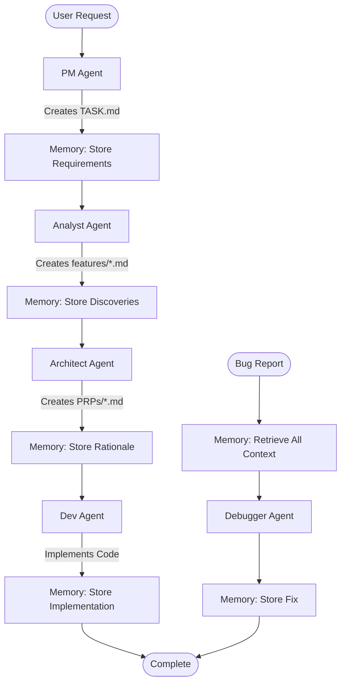

# Context Engineering Workflow with Memory Integration

## Overview

This document describes the complete Context Engineering workflow with integrated memory management. This system ensures rigorous requirements capture, prevents context loss, and maintains consistency across multi-agent development cycles.

## Architecture



## Agent Roles and Responsibilities

### 1. PM Agent (Project Manager)
**Purpose**: Conduct project intake and maintain task list

**Triggers**:
- New project initialization
- Adding features to existing project
- Major scope changes

**Workflow**:
1. Conducts structured interview for requirements
2. Creates/updates `project.md` with specifications
3. Creates/maintains `TASK.md` with numbered tasks
4. Estimates complexity and dependencies

**Outputs**:
- `project.md` - Project charter
- `TASK.md` - Numbered task list

### 2. Memory Agent (Context Coordinator)
**Purpose**: Prevent context loss and manage state

**Triggers**:
- Before ANY agent execution
- After ANY agent completion
- On validation gates
- On errors/failures

**Workflow**:
1. Check for task locks before agent starts
2. Retrieve relevant context from previous agents
3. Create task lock if clear to proceed
4. Store decisions and discoveries after completion
5. Release locks and update validation gates

**Outputs**:
- Task locks in memory bank
- Agent context records
- Validation gate results
- Execution history

### 3. Analyst Agent (Feature Documentarian)
**Purpose**: Transform tasks into detailed feature specifications

**Triggers**:
- Unchecked task exists in TASK.md
- User requests feature documentation

**Workflow**:
1. Memory: Check for locks on target task
2. Memory: Retrieve PM context
3. Read next incomplete task from TASK.md
4. Research technical requirements
5. Document edge cases and constraints
6. Create `features/<N>-<name>.md`
7. Memory: Store discoveries and constraints
8. Update TASK.md status

**Outputs**:
- `features/<N>-<name>.md` - Feature specification

### 4. Architect Agent (Requirements Engineer)
**Purpose**: Transform features into executable PRPs

**Triggers**:
- Feature document exists without PRP
- User requests PRP generation

**Workflow**:
1. Memory: Retrieve analyst discoveries
2. Select feature document (auto or specified)
3. Conduct parallel research (Brave, Context7, etc.)
4. Design implementation approach
5. Create validation gates and test cases
6. Generate `PRPs/<name>.md`
7. Memory: Store design rationale
8. Update tracking

**Outputs**:
- `PRPs/<name>.md` - Product Requirements Prompt

### 5. Dev Agent (Implementation Executor)
**Purpose**: Execute PRPs with validation

**Triggers**:
- PRP ready for implementation
- User requests PRP execution

**Workflow**:
1. Memory: Retrieve architect rationale
2. Load and validate PRP
3. Execute implementation steps sequentially
4. Run validation gates after each step
5. Execute tests and quality checks
6. Generate execution report
7. Memory: Store implementation details
8. Update TASK.md

**Outputs**:
- Implementation code
- `reports/prp-execution-*.md`
- Test results

### 6. Debugger Agent (Issue Resolver)
**Purpose**: Single-pass bug diagnosis and fix

**Triggers**:
- Error message or stack trace provided
- Failing test reported
- Bug identified

**Workflow**:
1. Memory: Retrieve ALL prior context
2. Analyze error/failure
3. Identify root cause
4. Implement minimal fix
5. Verify fix resolves issue
6. Memory: Store findings and fix
7. Update relevant documentation

**Outputs**:
- Bug fix code
- `reports/debug/*.md`
- Updated tests

## Memory Management Protocol

### Task Lock Flow
```
Before Work:
1. Agent requests work on task-001
2. Memory checks for existing locks
3. If locked: Wait or handle conflict
4. If clear: Create lock with agent ID
5. Provide context to agent

After Work:
1. Agent completes task
2. Memory stores output context
3. Release lock
4. Update validation gates
5. Trigger next agent if defined
```

### Context Preservation
```json
{
  "task_id": "001",
  "agent_sequence": [
    {
      "agent": "pm",
      "decisions": ["Prioritize auth over payment"],
      "context": "Security-first approach requested"
    },
    {
      "agent": "analyst", 
      "discoveries": ["Existing auth library available"],
      "constraints": ["Must support SSO"]
    },
    {
      "agent": "architect",
      "rationale": ["JWT chosen for stateless auth"],
      "tradeoffs": ["Requires refresh mechanism"]
    }
  ]
}
```

## Validation Gates

### Feature Document Validation
- Completeness check (>90% coverage)
- Edge cases documented
- Technical constraints identified
- Acceptance criteria defined

### PRP Validation
- All sections populated
- Test cases defined
- Implementation steps clear
- Validation gates specified

### Implementation Validation
- All tests pass
- Linter clean
- Type checking passes
- Performance benchmarks met

## Error Recovery Procedures

### Agent Failure
1. Memory preserves partial progress
2. Documents failure reason
3. Releases lock with error status
4. Stores recovery hints
5. Next attempt retrieves context

### Lock Conflicts
1. Check lock age (>2 hours = stale)
2. Archive stale lock
3. Create new lock with justification
4. Notify of override

### Context Loss Prevention
1. Regular checkpoints during long operations
2. Incremental context updates
3. Redundant storage (artifacts + memory)
4. Recovery from any checkpoint

## Workflow Examples

### Example 1: New Feature Implementation

```
User: "Add user authentication to the app"

1. PM Agent:
   - Interviews for requirements
   - Adds to TASK.md as task-001
   - Memory: Stores project context

2. Analyst Agent:
   - Memory: Checks no lock on task-001
   - Memory: Retrieves PM requirements
   - Creates features/001-authentication.md
   - Memory: Stores technical constraints

3. Architect Agent:
   - Memory: Retrieves analyst findings
   - Researches auth patterns
   - Creates PRPs/authentication.md
   - Memory: Stores JWT decision rationale

4. Dev Agent:
   - Memory: Retrieves full context chain
   - Implements auth system
   - Runs all validation gates
   - Memory: Stores implementation notes
   - Marks task-001 complete
```

### Example 2: Bug Fix with Context

```
User: "Login fails with 'undefined token' error"

1. Memory Agent:
   - Retrieves all auth-related context
   - Finds JWT implementation details
   - Provides to debugger

2. Debugger Agent:
   - Uses context to understand token flow
   - Identifies missing refresh logic
   - Implements fix
   - Memory: Stores root cause analysis
```

### Example 3: Parallel Task Handling

```
Two users working simultaneously:

User A: "Work on task-001"
1. Memory: Creates lock for task-001
2. Analyst proceeds with task-001

User B: "Work on task-001" (same task)
1. Memory: Detects existing lock
2. Reports conflict
3. Suggests task-002 instead
4. Creates lock for task-002
5. Analyst proceeds with task-002

No collision, both users productive
```

## Best Practices

### For Users
1. Let agents complete their workflow
2. Don't skip validation gates
3. Review memory conflicts before overriding
4. Commit only after full workflow

### For Agents
1. Always engage memory before starting
2. Store rationale, not just decisions
3. Release locks immediately after work
4. Check for prior context
5. Document blockers clearly

### For Projects
1. One project per repository
2. Maintain clean TASK.md
3. Archive old PRPs
4. Regular memory cleanup
5. Document patterns in examples/

## Metrics and Monitoring

### Success Indicators
- Zero task collisions
- 100% context retrieval success
- <5 second memory operations
- Complete audit trails
- Successful failure recovery

### Warning Signs
- Stale locks accumulating
- Memory retrieval failures
- Context gaps between agents
- Validation gates skipped
- TASK.md out of sync

## Directory Structure

```
project/
├── .claude/
│   ├── agents/
│   │   ├── pm.md
│   │   ├── memory.md
│   │   ├── analyst.md
│   │   ├── architect.md
│   │   ├── dev.md
│   │   └── debugger.md
│   └── CLAUDE.md
├── project.md
├── TASK.md
├── features/
│   └── <N>-<name>.md
├── PRPs/
│   └── <name>.md
├── reports/
│   ├── prp-execution-*.md
│   └── debug/*.md
├── src/
├── tests/
└── memory-bank/
    └── {project-name}/
        ├── agent-context/
        ├── task-locks/
        ├── validation-gates/
        └── checkpoints/
```

## Command Reference

### Starting New Project
```bash
# Initialize project with PM agent
claude "I need to build a task management API"
# PM agent conducts interview, creates project.md and TASK.md
```

### Creating Feature Documentation
```bash
# Analyst agent processes next task
claude "Create feature doc for the next task"
# Creates features/001-task-api.md
```

### Generating PRP
```bash
# Architect agent transforms feature to PRP
claude "Generate PRP for the task API feature"
# Creates PRPs/task-api.md
```

### Implementing Feature
```bash
# Dev agent executes PRP
claude "Implement the task API PRP"
# Implements code, runs tests, creates report
```

### Fixing Bugs
```bash
# Debugger uses memory for context-aware fix
claude "Fix: TypeError in task creation endpoint"
# Retrieves context, diagnoses, fixes
```

### Checking Memory
```bash
# Query memory state
claude "What's the current memory status for this project?"
# Shows locks, context, validation gates
```

## Troubleshooting

### "Task already locked"
- Check lock age with memory agent
- Override if stale (>2 hours)
- Or work on different task

### "Missing context"
- Memory agent retrieves available context
- Check if prior agents completed
- Manually provide missing information

### "Validation failed"
- Review validation gate requirements
- Check memory for prior issues
- Fix and retry with context

### "Agent produced unexpected output"
- Check memory for context gaps
- Verify prerequisites met
- Re-run with explicit instructions

## Summary

This Context Engineering workflow with memory integration ensures:
- **Rigorous requirements capture** through structured agents
- **Zero context loss** via persistent memory
- **Prevented race conditions** through task locking
- **Complete traceability** from requirement to implementation
- **Robust error recovery** with checkpointed state

The memory agent acts as the nervous system, connecting all agents with shared context and preventing the failures that typically derail complex software projects.